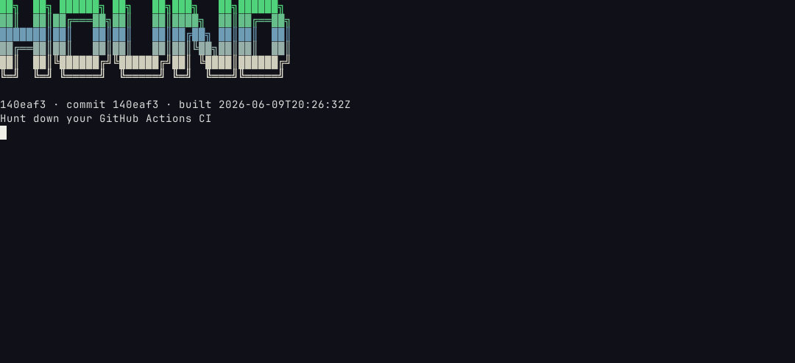
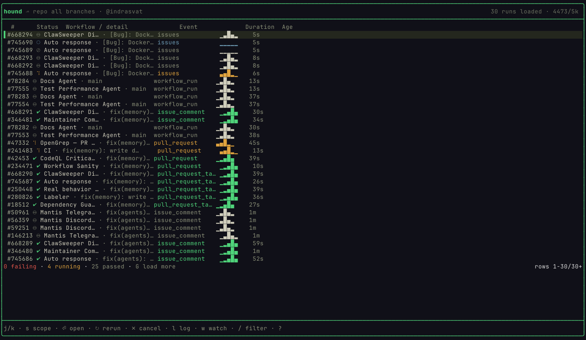
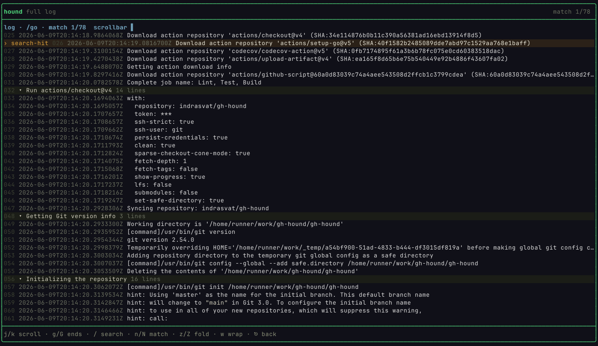
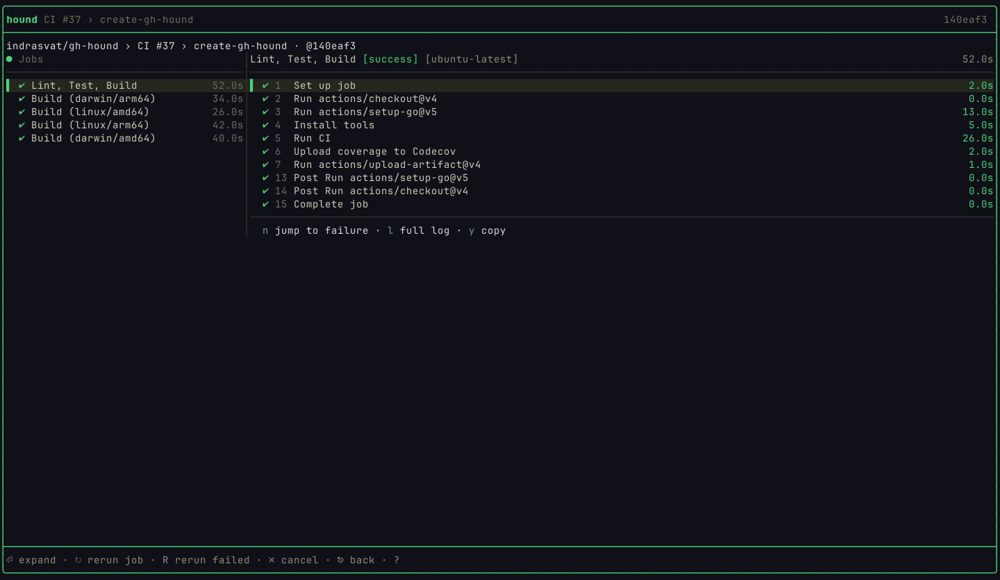
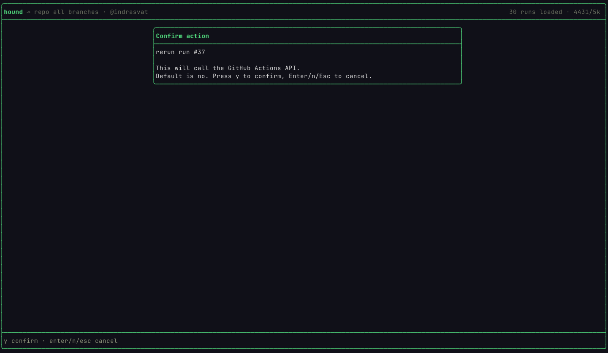
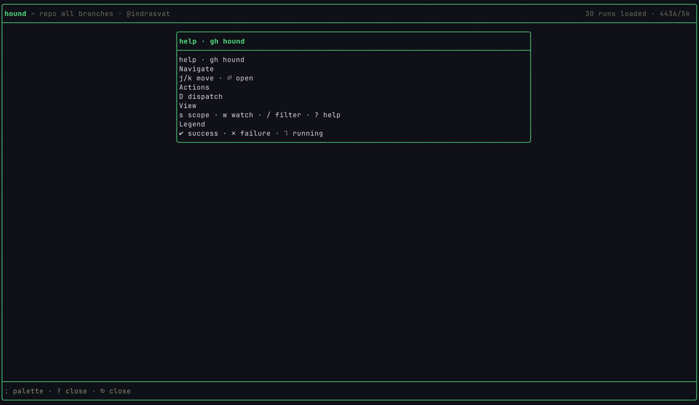

<p align="center">
  <br>
  <strong>Hunt down GitHub Actions failures from the terminal.</strong><br>
  <em>A fast, focused TUI for live runs, failure triage, rich logs, guarded actions, and agent-ready CI output.</em><br><br>
  <a href="https://github.com/indrasvat/gh-hound/actions/workflows/ci.yml"></a>
  <a href="https://github.com/indrasvat/gh-hound/releases/latest"></a>
  <a href="go.mod"></a>
  
</p>

<p align="center">
  <a href="#screenshots">Screenshots</a> •
  <a href="#why-gh-hound">Why</a> •
  <a href="#performance">Performance</a> •
  <a href="#features">Features</a> •
  <a href="#install">Install</a> •
  <a href="#agent-surface">Agent Surface</a> •
  <a href="#development">Development</a>
</p>

<p align="center">
  <a href="assets/readme/hero-gallery.png">
    
  </a>
  <br>
  <sub>High-resolution gallery. Click to open the full 3200px-wide image.</sub>
</p>

---

## Overview

`gh-hound` is a `gh` extension and standalone CLI/TUI for GitHub Actions. It opens on the CI state you usually care about: current repository, current branch or repo-wide scope, latest runs, selected job, step timeline, readable logs, and the actions to rerun, cancel, watch, or dispatch.

The human path is a keyboard-first terminal UI. The automation path is stable structured output: JSON, Markdown, XML, explicit exit codes, and failure objects with annotations and log excerpts.

## Screenshots

These frames were captured from the real binary through `shux`. The gallery uses live repositories: `openclaw/openclaw` for a high-volume Actions feed and `indrasvat/gh-hound` for run detail and full logs.

<p align="center">
  <a href="assets/readme/00-ascii-banner.png"></a><br>
  <sub>First impression: the actual `gh-hound --version` ASCII banner, rendered by the binary.</sub>
</p>

| Live runs at scale | Advanced full log viewer |
| --- | --- |
| <a href="assets/readme/02-openclaw-live-runs.png"></a> | <a href="assets/readme/09-gh-hound-self-log-search.png"></a> |
| OpenClaw repo-wide feed with status glyphs, run numbers first, event names, sparklines, summary counts, and visible rate budget. | Real CI log with 1,028 lines, line-number gutter, fold rows, scrollbar, and search-hit highlighting. |

| Run detail | Guarded actions |
| --- | --- |
| <a href="assets/readme/07-gh-hound-self-detail.png"></a> | <a href="assets/readme/11-action-confirm-rerun.png"></a> |
| Master-detail view for jobs and steps, with job durations and contextual footer actions. | Rerun/cancel flows are available from the TUI, but destructive API mutations require explicit confirmation. |

| Contextual help |
| --- |
| <a href="assets/readme/10-gh-hound-context-help.png"></a> |
| Help is generated from the active keymap and rendered as an overlay over the current screen. |

### Demo

<p align="center">
  
</p>

The demo is generated from `assets/demo.tape` with the current TUI: banner, live runs, detail, full logs, search, help, and a guarded rerun action.

## Why gh-hound

GitHub Actions debugging often means loading the checks page, opening a run, opening a job, expanding logs, searching manually, then jumping back to rerun or cancel. `gh-hound` keeps that loop close to the code:

- Launch directly from the repository you are editing.
- See the branch or repo-wide run state immediately.
- Move from run -> job -> step -> full log with the keyboard.
- Search and fold logs without waiting on a browser log viewer.
- Trigger rerun/cancel/dispatch flows from the same surface.
- Give coding agents a structured CI contract instead of screen-scraping.

### Compared With The GitHub Web UI

| Web UI friction | gh-hound behavior |
| --- | --- |
| Multiple page loads to get from check summary to the failing step. | One terminal launch, then `Enter` / `n` / `l` to move through run, job, failure, and log. |
| Browser log pages can feel heavy on large logs. | The TUI renders only the visible log window and keeps folding/search state local. |
| CI scope is easy to lose across tabs. | Header shows branch/repo scope, loaded count, rate budget, and live/cache state. |
| Rerun/cancel actions are separated from diagnosis. | Actions are available where the run is visible and guarded by explicit confirmation. |
| Agents must parse human pages or raw logs. | `--no-tui --json` returns schema-stable runs, failures, annotations, and excerpts. |

## Performance

`gh-hound` is built around the parts of the GitHub Actions API that matter for fast CI triage:

- **Server-side filtering** for runs: branch, status/conclusion, event, and repo-wide scope.
- **ETag-aware polling**: unchanged resources use conditional requests; idle views avoid burning the primary rate budget.
- **Serial request queue**: API calls and mutations are paced to avoid secondary rate-limit spikes.
- **Cache-first rendering**: the TUI paints from local state; network work returns through messages instead of blocking keystrokes.
- **Viewport-only log rendering**: large logs are parsed once and rendered by visible window, not dumped wholesale on every frame.
- **Large-list behavior**: long run lists are virtualized, with page-load affordances when more GitHub pages are available.

The local gate includes race-enabled Go tests, large-log performance tests, and `shux` visual/interaction audits across `80x24`, `120x40`, and `200x60`.

## Features

- **Runs home**: branch or repo-wide list, all-green state, status glyphs, run numbers, filters, summary counts, and rate/cache metadata.
- **Run detail**: master-detail job/step view with responsive collapse at narrow terminal sizes.
- **Failure diagnosis**: annotations, failing step, exit code, and de-noised failure excerpts.
- **Full log viewer**: line-number gutter, fold rows, search, match count, wrap toggle, scrollbar, and syntax-aware highlighting.
- **Watch mode**: active-run frame with follow, debug toggle, cancel, and detach.
- **Actions**: rerun failed, rerun run/job, cancel, force-cancel, and dispatch with confirmation where appropriate.
- **Dispatch form**: `workflow_dispatch` workflows and inputs rendered as a keyboard-driven form.
- **Overlays**: command palette, contextual help, confirm modals, and rate-limit/error toasts.
- **Themes and glyphs**: Bramble dark theme, Bone alternate, text-presentation Unicode, no emoji dependency.
- **Agent surface**: JSON/Markdown/XML output, Appendix-B schema, and exit codes `0/1/2/3`.
- **Verification harness**: `make vqa` captures every primary screen and interaction through `shux`.

## Install

### Build From Source

```bash
git clone https://github.com/indrasvat/gh-hound.git
cd gh-hound
make build
./bin/gh-hound --version
```

### Install Locally

```bash
make install
gh-hound --version
```

### GitHub CLI Extension

After the first tagged release is published:

```bash
gh extension install indrasvat/gh-hound
gh hound --version
```

### Standalone Release Installer

After the first tagged release is published:

```bash
curl -sSfL https://raw.githubusercontent.com/indrasvat/gh-hound/main/install.sh | bash
```

Pin a version or custom install directory:

```bash
curl -sSfL https://raw.githubusercontent.com/indrasvat/gh-hound/main/install.sh \
  | bash -s -- --version v0.1.0 --dir ~/.local/bin
```

## Quick Start

```bash
# Human TUI path
gh hound
gh hound -A
gh hound -R openclaw/openclaw -A
gh hound watch

# Agent/script path
gh hound runs --no-tui --json
gh hound runs --status failure --no-tui --json
gh hound watch --json
```

Local deterministic scenarios are available for docs, tests, and agent harnesses:

```bash
./bin/gh-hound runs --no-tui --json --fake-scenario green
./bin/gh-hound runs --no-tui --json --fake-scenario failure
./bin/gh-hound runs --no-tui --json --fake-scenario pending
./bin/gh-hound watch --json --fake-scenario failure
```

Fixture scenarios are intentionally restricted to non-interactive/test paths. The real TUI does not fall back to sample data.

## Controls

| Context | Keys |
| --- | --- |
| Global | `?` help, `:` palette, `T` theme, `q`/`Ctrl+C` quit, `Esc` back |
| Runs | `j/k` or arrows move, `g/G` top/bottom, `s` scope, `Enter` open, `/` filter, `l` logs, `w` watch |
| Actions | `r` rerun, `R` rerun failed, `x` cancel, `X` force cancel, `D` dispatch |
| Detail | `Tab` focus, `n` next failure, `l` logs, `J/K` next/previous run |
| Failure | `l` full log, `o` browser, `y` copy excerpt, `r` rerun job |
| Log | `/` search, `n/N` matches, `z/Z` fold, `w` wrap, `g/G` top/bottom |
| Watch | `f` follow, `d` debug, `x` cancel, `Esc` detach |
| Dispatch | `Tab` next, arrows/select controls, `Enter` run, `Esc` cancel |

## Configuration

Config lives at `~/.config/gh-hound/config.toml`. Environment variables and flags override file values.

```toml
default_scope = "branch"
auto_watch = false
per_page = 30
theme = "bramble"
log_level = "info"
```

See [docs/configuration.md](docs/configuration.md) for all supported values and precedence rules.

## Agent Surface

Use JSON for automation:

```bash
gh hound runs --status failure --no-tui --json | jq '.runs[0].failed[0]'
```

Exit codes:

| Code | Meaning |
| ---: | --- |
| 0 | all good |
| 1 | CI failure/action needed |
| 2 | API/network/config/render error |
| 3 | pending/running |

Schema and fixtures live under `internal/render/testdata/`. Full agent docs are in [docs/agent-surface.md](docs/agent-surface.md); the repo-local skill handoff is [skills/gh-hound/SKILL.md](skills/gh-hound/SKILL.md).

## Architecture

```text
cmd/gh-hound        Cobra CLI and gh extension entrypoint
internal/usecase    Shared CI workflows for TUI and pipe surfaces
internal/adapter    GitHub REST port, fake adapter, cache, poller
internal/render     JSON/Markdown/XML agent renderers
internal/tui        Bubble Tea-style app shell and screen renderers
internal/logs       Log parsing, folds, annotations, excerpts
.claude/automations shux VQA and interaction audit harness
```

The boundary is deliberate: usecases do not depend on the concrete GitHub client or the TUI. That keeps fake scenarios, agent JSON, and local tests deterministic while the live TUI stays wired to the real GitHub path.

## Development

```bash
make tools
make hooks
make check
make vqa
make docs-check
make demo
```

See [docs/development.md](docs/development.md) for the TDD workflow, Makefile target map, lefthook guardrails, shux VQA, and release-prep notes.

## Roadmap

- **v1**: current-branch CI, failure diagnosis, logs, watch, rerun/cancel/dispatch, JSON agent surface, release packaging.
- **v2**: run diff against last green, flake detection, multi-repo pulse, deployments, caches, artifacts, runners.
- **v3**: JSON-RPC/MCP `serve` mode for lifecycle events and multi-agent CI fix loops.

## License

MIT
