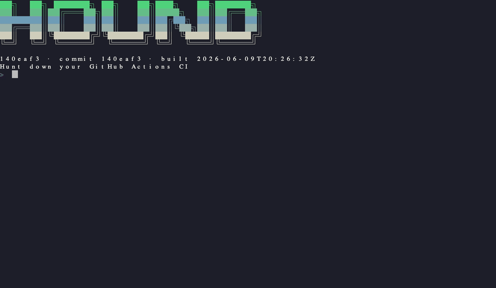

<p align="center">
  <br>
  <strong>Hunt down your GitHub Actions CI from the terminal</strong><br>
  <em>Runs, failures, logs, reruns, dispatches, and agent-ready JSON without tab archaeology.</em><br>
  <a href="https://github.com/indrasvat/gh-hound/actions/workflows/ci.yml"></a>
  <a href="https://github.com/indrasvat/gh-hound/releases/latest"></a>
  <a href="go.mod"></a>
  
</p>

<p align="center">
  <a href="#overview">Overview</a> •
  <a href="#why-gh-hound">Why</a> •
  <a href="#features">Features</a> •
  <a href="#install">Install</a> •
  <a href="#quick-start">Quick Start</a> •
  <a href="#controls">Controls</a> •
  <a href="#configuration">Configuration</a> •
  <a href="#agent-surface">Agent Surface</a> •
  <a href="#development">Development</a>
</p>

---

## Overview

`gh-hound` is a `gh` extension and standalone CLI/TUI for GitHub Actions. It opens on the CI state you usually care about: current repo, current branch, latest runs, failing job, failing step, readable log excerpt, and the actions to rerun, cancel, watch, or dispatch.

The TUI is tuned for terminal-first platform and backend work. The non-TUI pipe surface is tuned for agents: stable JSON, explicit exit codes, and failure objects that include annotations and log excerpts.

<p align="center">
  
</p>

## Why gh-hound

GitHub Actions debugging should not require bouncing through a browser tab, expanding ten accordions, and copying a noisy log into another tool. `gh-hound` keeps the loop close to the code:

- See branch CI state immediately.
- Jump from run to job to failed step.
- Read de-noised failure output with annotations.
- Stream an active run and fail fast when it turns red.
- Trigger reruns, cancellations, and `workflow_dispatch` flows.
- Give agents a structured contract instead of making them scrape terminal pixels.

## Features

- **Runs home**: branch-aware list, all-green state, status glyphs, duration sparkline, filters, and latest run summary.
- **Run detail**: master-detail job/step view with compact collapse at `80x24`.
- **Failure diagnosis**: annotations, failing step, exit code, and log excerpt centered on the real error.
- **Color log viewer**: searchable, foldable, wrapped log view that handles large logs without rendering everything.
- **Watch mode**: active-run frame with follow toggle, debug toggle, cancel, and detach.
- **Dispatch form**: `workflow_dispatch` form with text, boolean, and select inputs.
- **Overlays**: command palette, contextual help, confirmation flows, and toasts.
- **Bramble theme**: dark terminal palette derived from the HTML mocks, with a Bone alternate.
- **Agent surface**: JSON/Markdown/XML output, Appendix-B schema, golden fixture, and documented exit codes.
- **Verification harness**: shux VQA captures every screen at `80x24`, `120x40`, and `200x60`.

## Install

### Build from source

```bash
git clone https://github.com/indrasvat/gh-hound.git
cd gh-hound
make build
./bin/gh-hound --version
```

### Install locally

```bash
make install
gh-hound --version
```

### GitHub CLI extension

After the first tagged release is published, install it as a `gh` extension:

```bash
gh extension install indrasvat/gh-hound
gh hound --version
```

Release packaging and `gh-extension-precompile` wiring are tracked in `docs/tasks/180-ci-cd-release-install-and-smoke-verification.md`.

### Standalone release installer

After the first tagged release is published, install the standalone binary with checksum verification:

```bash
curl -sSfL https://raw.githubusercontent.com/indrasvat/gh-hound/main/install.sh | bash
```

Pin a version or custom directory:

```bash
curl -sSfL https://raw.githubusercontent.com/indrasvat/gh-hound/main/install.sh \
  | bash -s -- --version v0.1.0 --dir ~/.local/bin
```

## Quick Start

```bash
# Human TUI path
gh hound
gh hound runs
gh hound watch

# Agent/script path
gh hound runs --no-tui --json
gh hound runs --status failure --no-tui --json
gh hound watch --json
```

Local deterministic scenarios are available for docs, tests, and agent harnesses:

```bash
./bin/gh-hound runs --no-tui --json --fake-scenario green
./bin/gh-hound runs --no-tui --json --fake-scenario failure
./bin/gh-hound runs --no-tui --json --fake-scenario pending
./bin/gh-hound watch --json --fake-scenario failure
```

## Controls

| Context | Keys |
| --- | --- |
| Global | `?` help, `:` palette, `T` theme, `q`/`Ctrl+C` quit, `Esc` back |
| Runs | `j/k` move, `g/G` top/bottom, `Enter` open, `/` filter, `l` logs, `w` watch |
| Actions | `r` rerun, `R` rerun failed, `x` cancel, `X` force cancel, `D` dispatch |
| Detail | `Tab` focus, `n` next failure, `l` logs, `J/K` next/previous run |
| Failure | `l` full log, `o` browser, `y` copy excerpt, `r` rerun job |
| Log | `/` search, `n/N` matches, `z/Z` fold, `w` wrap, `g/G` top/bottom |
| Watch | `f` follow, `d` debug, `x` cancel, `Esc` detach |
| Dispatch | `Tab` next, arrows/select controls, `Enter` run, `Esc` cancel |

## Configuration

Config lives at `~/.config/gh-hound/config.toml`. Environment variables and flags override file values.

```toml
default_scope = "branch"
auto_watch = false
per_page = 30
theme = "bramble"
log_level = "info"
```

See [docs/configuration.md](docs/configuration.md) for all supported values and precedence rules.

## Agent Surface

Use JSON for automation:

```bash
gh hound runs --status failure --no-tui --json | jq '.runs[0].failed[0]'
```

Exit codes:

| Code | Meaning |
| ---: | --- |
| 0 | all good |
| 1 | CI failure/action needed |
| 2 | API/network/config/render error |
| 3 | pending/running |

Schema and fixtures live under `internal/render/testdata/`. Full agent docs are in [docs/agent-surface.md](docs/agent-surface.md); the repo-local skill handoff is [skills/gh-hound/SKILL.md](skills/gh-hound/SKILL.md).

## Architecture

```text
cmd/gh-hound        Cobra CLI and gh extension entrypoint
internal/usecase    Shared CI workflows for TUI and pipe surfaces
internal/adapter    GitHub REST port, fake adapter, cache, poller
internal/render     JSON/Markdown/XML agent renderers
internal/tui        Bubble Tea-style app shell and screen renderers
internal/logs       Log parsing, folds, annotations, excerpts
.claude/automations shux VQA and interaction audit harness
```

The boundary is deliberate: usecases do not depend on the concrete GitHub client or the TUI. That keeps fake scenarios, agent JSON, and local tests deterministic.

## Development

```bash
make tools
make hooks
make check
make vqa
make docs-check
make demo
```

See [docs/development.md](docs/development.md) for the TDD workflow, Makefile target map, lefthook guardrails, shux VQA, and release-prep notes.

## Roadmap

- **v1**: current-branch CI, failure diagnosis, logs, watch, rerun/cancel/dispatch, JSON agent surface, release packaging.
- **v2**: run diff against last green, flake detection, multi-repo pulse, deployments, caches, artifacts, runners.
- **v3**: JSON-RPC/MCP `serve` mode for lifecycle events and multi-agent CI fix loops.

## License

MIT
