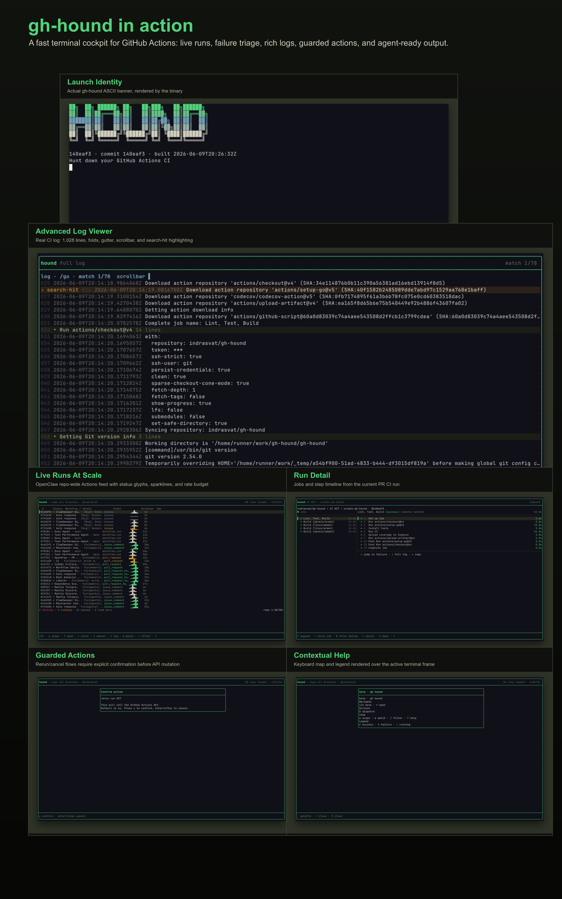

<p align="center">
  <br>
  <strong>GitHub Actions, without the browser side quest.</strong><br>
  <em>Hunts down "what broke?", "where?", "can I rerun it?", and "what should my agent fix?" — without leaving your terminal.</em><br><br>
  <a href="https://github.com/indrasvat/gh-hound/actions/workflows/ci.yml"></a>
  <a href="https://github.com/indrasvat/gh-hound/releases/latest"></a>
  
</p>

<p align="center">
  <a href="#why-gh-hound">Why</a> •
  <a href="#screenshots">Proof</a> •
  <a href="#performance">Performance</a> •
  <a href="#install">Install</a> •
  <a href="#quick-start">Quick Start</a> •
  <a href="#agent-surface">Agent Surface</a> •
  <a href="#development">Development</a>
</p>

<p align="center">
  <a href="assets/readme/hero-gallery.png">
    
  </a>
  <br>
  <sub>Real shux captures from live repositories. Click for the 3200px-wide image.</sub>
</p>

---

## Overview

`gh-hound` is a `gh` extension and standalone CLI/TUI for GitHub Actions. It opens where developers actually work: the current repository, the current branch or repo-wide scope, the latest runs, the selected job, the failing step, the full log, and the rerun/cancel/dispatch action surface.

The TUI is for humans. The structured output is for agents and scripts. Both paths share the same usecase core, so CI state, failures, annotations, excerpts, and exit codes stay consistent.

## Why gh-hound

Because "open Actions, click run, click job, expand logs, search, scroll, open another tab, forget which branch this was" is not a debugging workflow. It is a browser obstacle course.

`gh-hound` gives you the CI loop you wanted:

| Question | One terminal answer |
| --- | --- |
| Is my branch green? | `gh hound` opens the scoped run list with status, age, event, rate budget, and cache/live state. |
| What failed? | `Enter` drills into jobs and steps; `n` jumps to the next failure. |
| Where is the useful log line? | `l` opens the full log with folds, search, line numbers, highlights, and a scrollbar. |
| Can I retry safely? | `r`, `R`, `x`, and dispatch flows are local, visible, and confirmation-gated. |
| Can an agent consume this? | `--no-tui --json` returns schema-stable CI objects and deterministic exit codes. |

Short version: your browser has enough tabs. Keep CI triage beside the code.

## Screenshots

The top image is the gallery. Use these source frames when you want to inspect the pixels:

| Frame | What it proves |
| --- | --- |
| [ASCII banner](assets/readme/00-ascii-banner.png) | The first impression is branded, terminal-native, and rendered by the real binary. |
| [OpenClaw live runs](assets/readme/02-openclaw-live-runs.png) | Repo-wide high-volume Actions feed with run numbers first, event names, sparklines, scope, and rate budget. |
| [Full log viewer](assets/readme/09-gh-hound-self-log-search.png) | Real CI log rendering with line numbers, folds, scrollbar, search count, and highlighted matches. |
| [Run detail](assets/readme/07-gh-hound-self-detail.png) | Jobs and step timeline from a live run, not fixture data. |
| [Guarded rerun](assets/readme/11-action-confirm-rerun.png) | Mutation flows are present, but confirmation-gated. |
| [Context help](assets/readme/10-gh-hound-context-help.png) | Help is generated from the active keymap and overlays the current screen. |

### Demo

<p align="center">
  <a href="assets/demo.gif">
    
  </a>
  <br>
  <sub>Generated by <code>vhs assets/demo.tape</code>. Click to open the raw animation.</sub>
</p>

The GIF is deliberately secondary: static shux captures are the visual truth; VHS is the quick motion tour.

## Compared With The GitHub Web UI

| Web UI friction | gh-hound behavior |
| --- | --- |
| Multiple page loads to reach the failing step. | One terminal launch, then `Enter` / `n` / `l`. |
| Browser log pages can feel heavy on large logs. | The TUI renders only the visible log window and keeps folding/search state local. |
| Scope gets lost across tabs. | Header keeps branch/repo scope, loaded count, rate budget, and cache/live state visible. |
| Rerun/cancel lives away from diagnosis. | Actions are available in context and guarded by explicit confirmation. |
| Agents get raw pages or raw logs. | `--no-tui --json` returns schema-stable runs, failures, annotations, and excerpts. |
| Downloading an artifact means a browser trip. | List artifacts in run detail and download/extract with one confirmed keystroke, or `gh hound artifacts --download`. |
| Finding when a step hung means scrolling a 10k-line log. | `t` opens a time modal: step picker, slowest-gap detection, jump to `17:43`, or filter to `17:42-17:44`. |

## Performance

`gh-hound` is built around the parts of the GitHub Actions API that matter for fast CI triage:

- **Server-side filtering** for runs: branch, status/conclusion, event, and repo-wide scope.
- **ETag-aware polling**: unchanged resources use conditional requests; idle views avoid burning the primary rate budget.
- **Serial request queue**: API calls and mutations are paced to avoid secondary rate-limit spikes.
- **Cache-first rendering**: the TUI paints from local state; network work returns through messages instead of blocking keystrokes.
- **Viewport-only log rendering**: large logs are parsed once and rendered by visible window, not dumped wholesale on every frame.
- **Large-list behavior**: long run lists are virtualized, with page-load affordances when more GitHub pages are available.

The local gate includes race-enabled Go tests, large-log performance tests, and `shux` visual/interaction audits across `80x24`, `120x40`, and `200x60`.

## Features

- **Runs home**: branch or repo-wide list, all-green state, status glyphs, run numbers, filters, summary counts, and rate/cache metadata.
- **Run detail**: master-detail job/step view with responsive collapse at narrow terminal sizes.
- **Artifacts**: list a run's artifacts in detail view, download and auto-extract with confirmation; expired artifacts are flagged and refused up front.
- **Deployment approvals**: waiting runs wear a gate badge; `A` opens the gate overlay — pick environments, approve or reject with confirmation — and the `approvals` pipe verb does the same for agents. The `gh` CLI has no equivalent.
- **Cache kennel**: the `caches` verb and palette screen show Actions cache pressure against the 10 GB eviction cap — themed gauge, sortable list (biggest or stalest first), key filter, and confirm-gated deletes by ID or key with the match count shown before anything is dug up. Past 90% the kennel warns before GitHub starts evicting.
- **Time navigation**: a `t` modal on the log screen with a landmark picker (step boundaries, the failure window, the slowest gaps), typed jumps (`17:43`, `+30s`, `-2m`), and `A-B` range filtering.
- **Status cycle**: `f` on the runs screen cycles all / failing / running / passed through the server filter.
- **Attempt forensics**: `runs --run <id> --attempt <n>` triages a specific attempt after a re-run -- failed jobs, clean excerpts, exit codes.
- **The trail**: `diff` walks a workflow's history to the last-green → first-red boundary and names the suspect commits -- the answer `git bisect` re-runs builds for is already in the run history. TUI screen via `:diff`, JSON verdict for agents, `diff_max_pages` bounds the spend.
- **Flake forensics**: `flakes` answers "real failure or flake?" with a scored, evidenced verdict -- attempt flips, cross-run flapping, and retry-wrapper masking over the last `flake_window` runs. The failure screen recognizes the scent (`seen this one before: flaked 2 of last 50 runs`) with evidence drill-down, known flakers wear a `~` badge on the runs list, and agents branch on `status`: `flaky` -> rerun, `clean` -> investigate.
- **The pack**: `:workflows` lists every workflow with its state badge -- `✔ active`, `◌ asleep` (fell asleep after 60 quiet days, the classic "my cron stopped" mystery), `⊘ muzzled` (disabled by hand), `⊘ fork-disabled`, `✗ deleted` -- and `e` wakes or muzzles the toggleable ones, confirm-gated. The `workflows` pipe verb lists states and flips them by id or file path. Disabled workflows are named on the empty screen, and the dispatch picker badges them instead of hiding them.
- **Failure diagnosis**: annotations, failing step, exit code, and de-noised failure excerpts.
- **Full log viewer**: line-number gutter, fold rows, search, match count, wrap toggle, scrollbar, and syntax-aware highlighting.
- **Watch mode**: active-run frame with follow, debug toggle, cancel, and detach.
- **The hunt**: `w` watches the selected run's whole event group — one row per workflow, `the hunt: 3 running · 1 home · 0 lost` header, drill into any run, follow-worst mode — on one runs-list call per poll. `watch --group` streams the same hunt as NDJSON for agents, and dispatch/rerun can hand off straight into watch (`auto_watch`).
- **Actions**: rerun failed, rerun run/job, cancel, force-cancel, and dispatch with confirmation where appropriate.
- **Dispatch form**: `workflow_dispatch` workflows and inputs rendered as a keyboard-driven form. Foreign `-R` targets pre-fill their own default branch (never your local checkout's), and refs are validated as a real branch or tag before anything fires.
- **Overlays**: command palette, contextual help, confirm modals, and rate-limit/error toasts.
- **Themes and glyphs**: Bramble dark theme, Bone alternate, text-presentation Unicode, no emoji dependency.
- **Agent surface**: JSON/Markdown/XML output, Appendix-B schema, and exit codes `0/1/2/3`. The leash works both ways: `rerun`, `cancel`, and `caches --delete-id/--delete-key` act from the same surface (`--failed-only`, `--job`, `--debug`, `--force`, `--ref`).
- **Async everywhere**: no keystroke blocks on the network — shared spinner, dimmed reloads, instant skeletons, byte-progress bars on multi-MB log downloads, esc cancels the work itself.
- **Verification harness**: `make vqa` captures every primary screen and interaction through `shux`.

## Install

### Build From Source

```bash
git clone https://github.com/indrasvat/gh-hound.git
cd gh-hound
make build
./bin/gh-hound --version
```

### Install Locally

```bash
make install
gh-hound --version
```

### GitHub CLI Extension

After the first tagged release is published:

```bash
gh extension install indrasvat/gh-hound
gh hound --version
```

### Standalone Release Installer

After the first tagged release is published:

```bash
curl -sSfL https://raw.githubusercontent.com/indrasvat/gh-hound/main/install.sh | bash
```

Pin a version or custom install directory:

```bash
curl -sSfL https://raw.githubusercontent.com/indrasvat/gh-hound/main/install.sh \
  | bash -s -- --version v0.1.0 --dir ~/.local/bin
```

## Quick Start

```bash
# Human TUI path
gh hound
gh hound -A
gh hound -R openclaw/openclaw -A
gh hound watch

# Agent/script path
gh hound runs --no-tui --json
gh hound runs --status failure --no-tui --json
gh hound watch --json
gh hound watch --group --no-tui
gh hound rerun --run <id> --failed-only --debug --no-tui --json
gh hound cancel --run <id> --no-tui --json
gh hound diff --workflow CI --no-tui --json            # who broke main?
gh hound flakes --workflow CI --no-tui --json          # flaky or real?
gh hound workflows --no-tui --json                     # every workflow + state (why did my cron stop?)
gh hound workflows --enable ci.yml --no-tui --json     # wake it: back on duty
gh hound workflows --disable 290736476 --no-tui --json # muzzle it (id or file path)
gh hound artifacts --no-tui --json
gh hound artifacts --run <run-id> --download <name> --dir <path> --no-tui --json
gh hound runs --run <run-id> --attempt 2 --no-tui --json   # forensics on a re-run
```

Local deterministic scenarios are available for docs, tests, and agent harnesses:

```bash
./bin/gh-hound runs --no-tui --json --fake-scenario green
./bin/gh-hound runs --no-tui --json --fake-scenario failure
./bin/gh-hound runs --no-tui --json --fake-scenario pending
./bin/gh-hound watch --json --fake-scenario failure
./bin/gh-hound diff --workflow CI --no-tui --json --fake-scenario regression
./bin/gh-hound watch --group --no-tui --fake-scenario pack   # staggered 3-run pack
```

Fixture scenarios are intentionally restricted to non-interactive/test paths. The real TUI does not fall back to sample data.

## Controls

| Context | Keys |
| --- | --- |
| Global | `?` help, `:` palette, `T` theme, `q`/`Ctrl+C` quit, `Esc` back |
| Runs | `j/k` or arrows move, `g/G` top/bottom, `s` scope, `Enter` open, `f` status cycle, `/` filter, `l` logs, `w` watch, `A` approvals (waiting runs) |
| Actions | `r` rerun, `R` rerun failed, `x` cancel, `X` force cancel, `D` dispatch |
| Detail | `Tab` focus, `n` next failure, `l` logs, `a` artifacts, `d` download, `J/K` next/previous run |
| Failure | `l` full log, `o` browser, `y` copy excerpt, `r` rerun job |
| Log | `/` search, `t` time jump/range, `n/N` matches, `z/Z` fold, `w` wrap, `g/G` top/bottom |
| Watch | `f` follow, `d` debug, `x` cancel, `Esc` detach |
| Hunt board | `j/k` move, `Enter` drill into one run, `f` follow worst, `x` cancel, `Esc` back |
| Dispatch | `Tab` next, arrows/select controls, `Enter` run, `Esc` cancel |
| Trail (diff) | `j/k` move suspects, `Enter` open first bad run, `o` compare in browser, `Esc` back |
| Scent check (flakes) | `j/k` move evidence, `Enter` open that run, `Esc` back; on the failure screen `Tab` toggles excerpt/panel focus |
| Kennel (workflows) | `j/k` move, `e` wake/muzzle (confirm-gated), `o` browser, `Esc` back |

## Configuration

Config lives at `~/.config/gh-hound/config.toml`. Environment variables and flags override file values.

```toml
default_scope = "branch"
auto_watch = false
per_page = 30
diff_max_pages = 10
watch_group_max = 10
theme = "bramble"
log_level = "info"
```

See [docs/configuration.md](docs/configuration.md) for all supported values and precedence rules.

## Agent Surface

Use JSON for automation:

```bash
gh hound runs --status failure --no-tui --json | jq '.runs[0].failed[0]'
gh hound diff --workflow CI --no-tui --json | jq '{status, verdict, suspects: .total_suspects}'
```

The `diff` verdict is a JSON object agents can branch on: `status` is `located` (exit `1` -- a regression exists), `green`, or `inconclusive` (both exit `0`), with `last_good`, `first_bad`, `suspect_commits[]`, and `compare_url` when the boundary is found.

```bash
gh hound flakes --workflow CI --no-tui --json | jq '{status, verdict}'
```

The `flakes` verdict is the rerun-vs-investigate decision: `status` is `flaky` or `suspect` (exit `1` -- rerun or look closer; per-job `flake_score`, signal counts, and `evidence[]` say why) or `clean` / `insufficient_data` (exit `0` -- chase the failure for real). Thresholds are documented in `docs/agent-surface.md`.

Exit codes:

| Code | Meaning |
| ---: | --- |
| 0 | all good |
| 1 | CI failure/action needed |
| 2 | API/network/config/render error |
| 3 | pending/running |

Schema and fixtures live under `internal/render/testdata/`. Full agent docs are in [docs/agent-surface.md](docs/agent-surface.md); the repo-local skill handoff is [skill/SKILL.md](skill/SKILL.md).

## Architecture

```text
cmd/gh-hound        Cobra CLI and gh extension entrypoint
internal/usecase    Shared CI workflows for TUI and pipe surfaces
internal/adapter    GitHub REST port, fake adapter, cache, poller
internal/render     JSON/Markdown/XML agent renderers
internal/tui        Bubble Tea-style app shell and screen renderers
internal/logs       Log parsing, folds, annotations, excerpts
.claude/automations shux VQA and interaction audit harness
```

The boundary is deliberate: usecases do not depend on the concrete GitHub client or the TUI. That keeps fake scenarios, agent JSON, and local tests deterministic while the live TUI stays wired to the real GitHub path.

## Development

```bash
make tools
make hooks
make check
make vqa
make docs-check
make demo
```

See [docs/development.md](docs/development.md) for the TDD workflow, Makefile target map, lefthook guardrails, shux VQA, and release-prep notes.

## Roadmap

- **v1**: current-branch CI, failure diagnosis, logs, watch, rerun/cancel/dispatch, JSON agent surface, release packaging.
- **v2**: multi-repo pulse, deployments, runners. (Artifacts shipped in v0.2.0; run diff against last green shipped as `diff` — the trail; flake detection shipped as `flakes` — the scent check.)
- **v3**: JSON-RPC/MCP `serve` mode for lifecycle events and multi-agent CI fix loops.

## License

MIT
